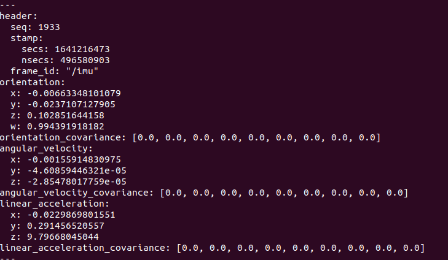

# `nav40_driver`

针对创衡控制的 `NAV30/40/50`系列组合惯导开发的ROS驱动DEMO。该驱动主要工作是打开串口，根据厂家提供的用户手册中的数据帧结构说明进行数据解析，并且封装成ros的sensor_msgs/IMU消息发布。

## 使用

```bash
sudo apt-get install ros-melodic-serial
cd ~/catkin_ws/src
git clone
cd .. && catkin build nav40_driver
```

编译成功后运行

```bash
source devel/setup.bash
roslaunch nav40_driver nav40_driver.launch
```

测试

```bash
rostopic echo /imu/data
```


